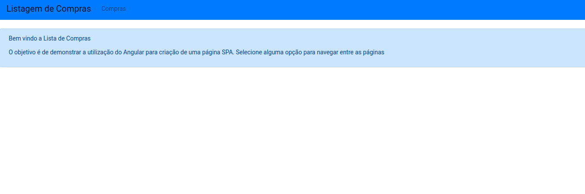
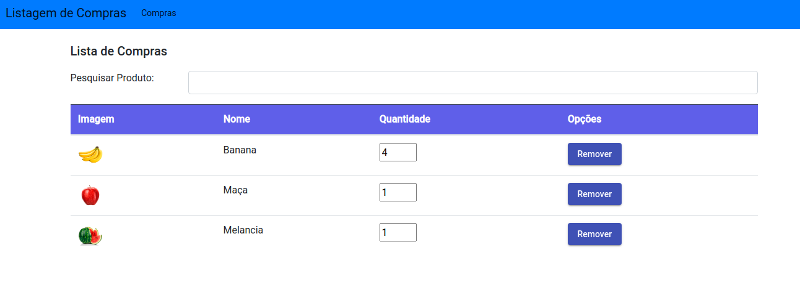
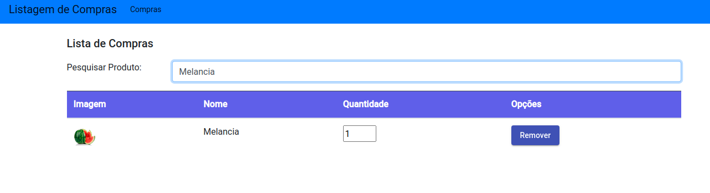

## Lista de Compras

Esse projeto foi criado com Angular, com o objetivo de ser uma listagem de compras.

## Tecnologias
Angular
Angular Material
Routing
HttpClient
RxJS
TypeScript
HTML
CSS
BootStrap
Json Server

## Imagens

- Página Principal

- Listagem de Produtos

- Pesquisa de Produto

## Execução - Servidor Web

Digite `npm  install` para baixar as dependências necessárias.
Digite `ng serve`. Acesse a página `http://localhost:4200/`.

## Execução - Servidor JSON

Digite `json-server --watch db.json -d` para executar o servidor json.
